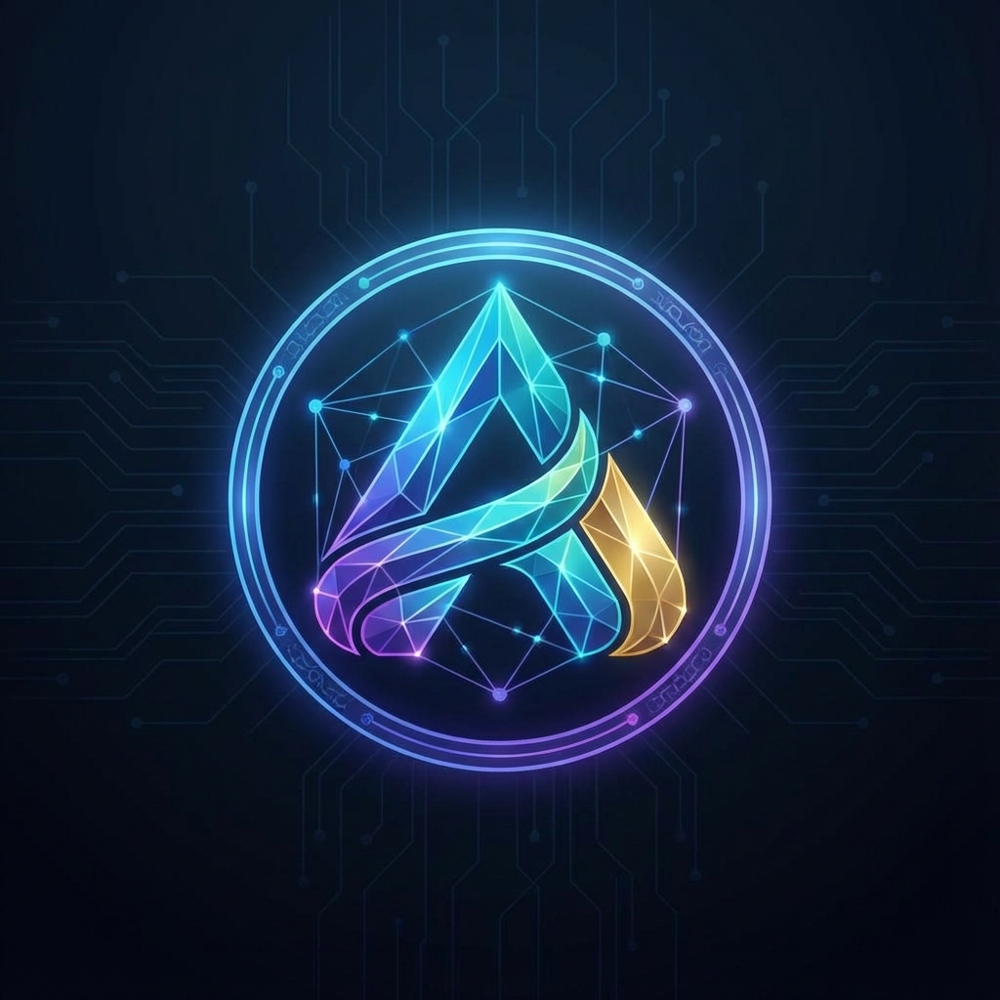

# 🔐 Corders - CCTV Analytics Dashboard

<div align="center">



**Real-time CCTV Monitoring with AI-Powered People Detection**

[](https://nextjs.org/)
[](https://www.typescriptlang.org/)
[](https://tailwindcss.com/)
[](https://cloud.google.com/vision)

</div>

---

## 📋 Overview

**Corders** adalah dashboard monitoring CCTV canggih yang dilengkapi dengan deteksi orang menggunakan AI. Aplikasi ini memungkinkan monitoring real-time dari berbagai sumber video (video lokal dan live stream YouTube) dengan analisis otomatis menggunakan Google Cloud Vision API.

### ✨ Fitur Utama

| Fitur | Deskripsi |
|-------|-----------|
| 📊 **Dashboard Real-time** | Ringkasan aktivitas semua kamera dalam satu tampilan |
| 👥 **AI People Detection** | Deteksi dan penghitungan orang otomatis menggunakan Google Cloud Vision |
| 📹 **Multi-source Video** | Dukungan video lokal (.mp4) dan live stream YouTube |
| 🤖 **AI Chat Assistant** | Asisten AI untuk menganalisis data monitoring (Kolosal AI) |
| 📈 **Analytics & Charts** | Visualisasi data traffic dan demografi pengunjung |
| 🌙 **Modern Dark UI** | Interface sci-fi dengan glassmorphism dan neon accents |
| 🔄 **Background Analysis** | Analisis berjalan di background tanpa mengganggu UI |

---

## 🏗️ Arsitektur

```
┌─────────────────────────────────────────────────────────────────┐
│                         FRONTEND (Next.js)                       │
├─────────────────────────────────────────────────────────────────┤
│  ┌─────────────┐  ┌─────────────┐  ┌─────────────┐              │
│  │  Dashboard  │  │  Live View  │  │  Analytics  │  Settings    │
│  └──────┬──────┘  └──────┬──────┘  └──────┬──────┘              │
│         │                │                │                      │
│         └────────────────┼────────────────┘                      │
│                          │                                       │
│              ┌───────────▼───────────┐                          │
│              │   AnalysisContext     │  (React Context)         │
│              │   - feeds state       │                          │
│              │   - stats management  │                          │
│              └───────────┬───────────┘                          │
│                          │                                       │
│         ┌────────────────┼────────────────┐                      │
│         │                │                │                      │
│  ┌──────▼──────┐  ┌──────▼──────┐  ┌──────▼──────┐              │
│  │ Background  │  │ LiveFeed    │  │ AI Chat     │              │
│  │ Analyzer    │  │ Cards       │  │ Component   │              │
│  └──────┬──────┘  └─────────────┘  └──────┬──────┘              │
├─────────┼─────────────────────────────────┼─────────────────────┤
│         │          API ROUTES             │                      │
│  ┌──────▼──────┐              ┌───────────▼───────────┐         │
│  │ /api/analyze│              │   /api/ai-chat        │         │
│  └──────┬──────┘              └───────────┬───────────┘         │
├─────────┼─────────────────────────────────┼─────────────────────┤
│         │       EXTERNAL SERVICES         │                      │
│  ┌──────▼──────────────┐    ┌─────────────▼─────────────┐       │
│  │ Google Cloud Vision │    │      Kolosal AI API       │       │
│  │ - Object Detection  │    │  - Chat Completions       │       │
│  │ - Face Detection    │    │  - Context-aware Response │       │
│  └─────────────────────┘    └───────────────────────────┘       │
└─────────────────────────────────────────────────────────────────┘
```

---

## 📁 Struktur Project

```
Corders/
├── public/
│   ├── logo.jpg                    # Logo aplikasi
│   ├── videos/                     # Sample video files
│   │   ├── sample.mp4
│   │   └── sample2.mp4
│   └── analyzed_sample*.mp4        # Pre-analyzed video demos
│
├── src/
│   ├── app/
│   │   ├── page.tsx                # Dashboard utama
│   │   ├── analytics/page.tsx      # Halaman analytics
│   │   ├── live/page.tsx           # Live camera feeds
│   │   ├── settings/page.tsx       # Pengaturan sistem
│   │   ├── layout.tsx              # Root layout
│   │   ├── globals.css             # Global styles
│   │   └── api/
│   │       ├── analyze/route.ts    # Vision API endpoint
│   │       ├── ai-chat/route.ts    # AI Chat endpoint
│   │       ├── video/route.ts      # Video streaming
│   │       ├── video-feeds/        # Feed management
│   │       └── youtube-frame/      # YouTube frame capture
│   │
│   ├── components/
│   │   ├── BackgroundAnalyzer.tsx  # Background analysis engine
│   │   ├── layout/
│   │   │   ├── Sidebar.tsx         # Navigation sidebar
│   │   │   └── Header.tsx          # Top header
│   │   └── ui/
│   │       ├── AIChat.tsx          # AI Chat component
│   │       ├── LiveFeedCard.tsx    # Camera feed card
│   │       ├── VideoPlayer.tsx     # Video player
│   │       ├── YouTubeEmbed*.tsx   # YouTube integration
│   │       ├── button.tsx          # UI: Button
│   │       ├── card.tsx            # UI: Card
│   │       └── badge.tsx           # UI: Badge
│   │
│   ├── contexts/
│   │   └── AnalysisContext.tsx     # Global state management
│   │
│   └── lib/
│       ├── types.ts                # TypeScript interfaces
│       └── utils.ts                # Utility functions
│
├── .env.example                    # Environment template
├── .gitignore
├── package.json
├── tsconfig.json
└── README.md
```

---

## 🚀 Getting Started

### Prerequisites

- Node.js 18+ 
- npm atau yarn
- Google Cloud account dengan Vision API enabled
- Kolosal AI API key (untuk fitur AI Chat)

### Installation

1. **Clone repository**
   ```bash
   git clone <repository-url>
   cd Corders
   ```

2. **Install dependencies**
   ```bash
   npm install
   ```

3. **Setup environment variables**
   ```bash
   cp .env.example .env.local
   ```

4. **Edit `.env.local`** dengan kredensial Anda:
   ```env
   # Kolosal AI API Key
   KOLOSAL_API_KEY=kol_your_actual_api_key
   
   # Google Cloud Vision (pilih salah satu)
   # Option 1: JSON string (untuk Vercel)
   GOOGLE_APPLICATION_CREDENTIALS_JSON={"type":"service_account",...}
   
   # Option 2: File path (untuk local development)
   GOOGLE_APPLICATION_CREDENTIALS=/path/to/service-account.json
   ```

5. **Run development server**
   ```bash
   npm run dev
   ```

6. **Buka browser**
   ```
   http://localhost:3000
   ```

---

## 🔧 Environment Variables

| Variable | Required | Description |
|----------|----------|-------------|
| `KOLOSAL_API_KEY` | Yes* | API key untuk Kolosal AI Chat (*opsional jika tidak menggunakan AI Chat) |
| `GOOGLE_APPLICATION_CREDENTIALS_JSON` | Yes** | JSON string dari service account Google Cloud |
| `GOOGLE_APPLICATION_CREDENTIALS` | Yes** | Path ke file service account JSON |

> **Note:** Pilih salah satu antara `GOOGLE_APPLICATION_CREDENTIALS_JSON` atau `GOOGLE_APPLICATION_CREDENTIALS`

---

## 🎨 Tech Stack

### Frontend
- **Next.js 14+** - React framework dengan App Router
- **TypeScript** - Type-safe JavaScript
- **Tailwind CSS** - Utility-first CSS framework
- **Recharts** - Charting library untuk visualisasi data
- **Lucide React** - Icon library

### Backend
- **Next.js API Routes** - Serverless API endpoints
- **Google Cloud Vision API** - AI untuk object & face detection
- **Kolosal AI API** - AI chat assistant

### Styling
- **Glassmorphism** - Efek blur background
- **Neon Accents** - Warna neon (#00ff94 primary)
- **Dark Theme** - Tema gelap sci-fi

---

## 📊 Cara Kerja

### 1. Background Analysis
- `BackgroundAnalyzer` component berjalan di background
- Mengambil frame dari video/YouTube setiap 5-15 detik
- Mengirim frame ke `/api/analyze` untuk deteksi
- Update `AnalysisContext` dengan hasil deteksi

### 2. People Detection
- Frame dikirim ke Google Cloud Vision API
- Menggunakan `OBJECT_LOCALIZATION` untuk mendeteksi "person"
- Menggunakan `FACE_DETECTION` untuk mendeteksi wajah
- Hasil gabungan menentukan jumlah orang

### 3. AI Chat
- User mengirim pertanyaan
- Context data real-time disertakan (jumlah orang, kamera aktif, dll)
- Kolosal AI memberikan respons berdasarkan context

---

## 📱 Screenshots

### Dashboard
Tampilan ringkasan dengan statistik kamera, jumlah orang terdeteksi, dan alert.

### Live View
Grid kamera dengan live feed dan deteksi real-time.

### Analytics
Grafik visitor traffic, demografi, dan AI Chat assistant.

---

## 🔒 Security Notes

> ⚠️ **PENTING:**
> - JANGAN commit file `.env.local` atau service account JSON ke git
> - Gunakan environment variables di production
> - Rotate API keys secara berkala
> - File `.env.example` hanya sebagai template

---

## 📝 License

MIT License - feel free to use this project for learning or commercial purposes.

---

<div align="center">

**Built with ❤️ using Next.js & Google Cloud Vision**

</div>
